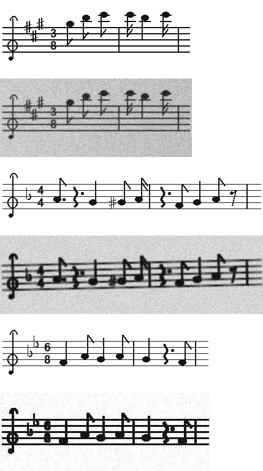
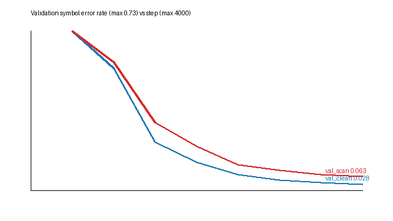

# omr-transformer

End-to-end optical music recognition in PyTorch: a single-staff image goes in;
a sequence of music tokens, MusicXML and MIDI come out. The model is a CNN plus
Transformer encoder-decoder trained from scratch, with greedy and beam decoding,
symbol-level evaluation, and robustness testing against phone-scan style damage.


*Training data: each clean render (odd rows) and the same staff after random
scan degradation (even rows).*

## Results

Trained 4,000 steps (batch 32, about 128k generated staves) on an Apple M4 GPU
in 78 minutes. Test sets are 1,000 staves each from a seed range never used in
training or validation.

| Test set | SER | Pitch ER | Duration ER | Exact staves |
|---|---|---|---|---|
| Clean renders | **2.8%** | 2.5% | 1.0% | 67.4% |
| Scan-style degraded | **7.3%** | 6.3% | 2.9% | 53.1% |

SER is the symbol error rate: token-level edit distance divided by reference
length. Pitch ER and duration ER apply the same measure after splitting each
note token into its pitch and duration parts, so they show which half of the
symbol is wrong. Beam search (k=4) lowers scan SER from 6.9% to 6.3% on a
200-staff subset (`test_results_beam4.json`).



**Where it fails.** Almost all of the ten most frequent confusions are
accidentals: a sharp, flat or natural read as the wrong sign or missed
(`C#4 -> C4`, `Gb2 -> G#2`). Only about 8% of notes carry an explicit
accidental, and the glyphs are small, so this is the class to target next:
oversample altered notes, or give the encoder more vertical resolution near the
notehead. Dots are the second weakness, as in the demo below.

**Demo** (`docs/demo_input.png`, degraded): the prediction matches the ground
truth on 14 of 15 symbols; the miss is the final note, a dotted half read as a plain half.

## How it works

```
image 1x128xW
  -> CNN: strided stem + 3 conv blocks (height /16, width /8)   -> 128 x 8 x W/8
  -> flatten height into channels, linear to d=256, sinusoidal positions
  -> Transformer encoder (4 layers, 8 heads, pre-norm)
  -> Transformer decoder (4 layers, causal self-attention, cross-attention)
  -> logits over 723 music tokens
```

8.6M parameters. Training uses teacher forcing, label smoothing 0.1, AdamW,
linear warmup and cosine decay, and gradient clipping at 1.0. The best
checkpoint is chosen on validation SER over the degraded set.

**Tokens** follow the PrIMuS "semantic" encoding (`clef-G2`, `keySignature-DM`,
`timeSignature-6/8`, `note-F#4_quarter.`, `rest-eighth`, `barline`), so a model
trained here can be fine-tuned on real PrIMuS / Camera-PrIMuS data without
changing the output head (`--primus-root`).

**Data.** `omr/sequence.py` generates musically valid staves: measures fill the
time signature exactly, melodies move mostly by step, notes follow the key
signature, and about 8% carry an explicit accidental. `omr/render.py` engraves
them (two clefs, seven keys, five time signatures, eight durations including
dotted values, ledger lines, flags and rests), and `omr/augment.py` adds
rotation, scaling, ink spread, blur, uneven lighting, noise and JPEG
compression. Each sample is seeded by its split and index, so validation and
test sets are fixed and runs are reproducible.

## Engineering notes

- **Apple MPS memory.** The first full run grew to 24 GB of GPU memory and
  stalled the machine in swap. With a fixed batch the footprint was flat at
  6.9 GB, which traced the growth to variable tensor shapes: MPS keeps cached
  buffers per shape and does not reuse them across shapes. The fix is to pad
  every batch to one shape (1024 px x 40 tokens; the widest generated staff is
  968 px), use a strided first convolution to shrink activations, and cap the
  allocator with `PYTORCH_MPS_HIGH_WATERMARK_RATIO` so a leak fails fast
  instead of swapping. Memory then stayed at 5.7 GB for the whole run.
- **Masking test.** `test_overfits_one_batch` trains a small model until it
  memorises four staves exactly. That catches off-by-one errors in the
  target shift and broken causal or padding masks, which otherwise only show up
  as a model that never converges.

## Usage

```bash
pip install -r requirements.txt
python -m omr.train --out runs/base --steps 4000          # train
python -m omr.evaluate --ckpt runs/base/best.pt --size 1000   # test sets
python -m omr.evaluate --ckpt runs/base/best.pt --size 200 --beam 4
python -m omr.predict --ckpt runs/base/best.pt --image staff.png --out out/
python scripts/make_figures.py runs/base
PYTEST_DISABLE_PLUGIN_AUTOLOAD=1 python -m pytest -q      # 57 tests
```

`predict` writes `<name>.tokens.txt`, `<name>.musicxml` (opens in MuseScore)
and `<name>.mid`.

## Limits and next steps

- The training images are synthetic and engraved by a simple renderer: one
  voice, no beams, no chords, no slurs or dynamics. The degraded test set
  measures robustness to scan damage, not accuracy on real printed scores.
- Next: fine-tune on Camera-PrIMuS (87k real incipits with photo distortion)
  and report SER on its official split; add beams and chords to the renderer;
  try a CTC head as a faster baseline; target the accidental errors above.
- The checkpoint (`runs/base/best.pt`, about 100 MB) is not committed.

## Layout

```
omr/vocab.py      token vocabulary (PrIMuS-compatible)
omr/sequence.py   random valid staves
omr/render.py     engraver
omr/augment.py    scan degradations
omr/data.py       synthetic and PrIMuS datasets, fixed-shape batching
omr/model.py      CNN + Transformer encoder-decoder, greedy and beam search
omr/train.py      training loop
omr/evaluate.py   test-set metrics and confusion analysis
omr/predict.py    image -> tokens / MusicXML / MIDI
omr/export.py     MusicXML and MIDI writers
omr/metrics.py    SER, pitch and duration error rates
tests/            57 tests
```
